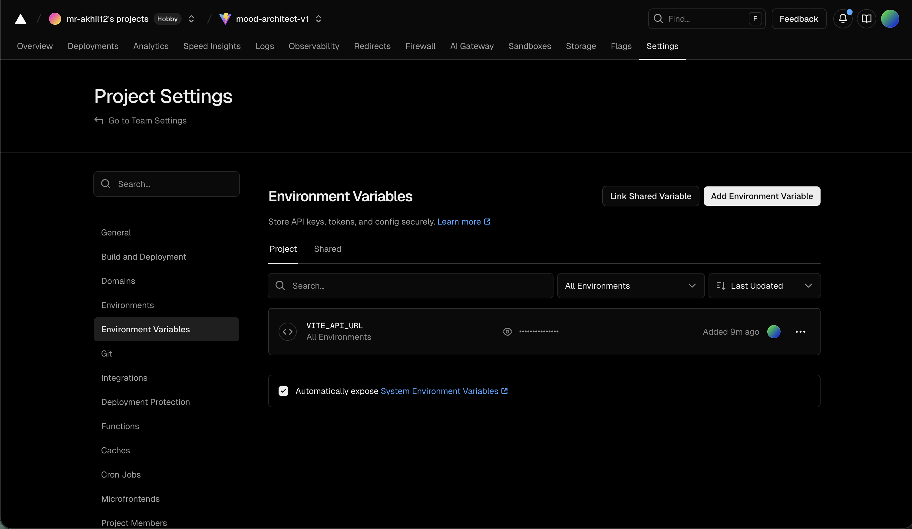
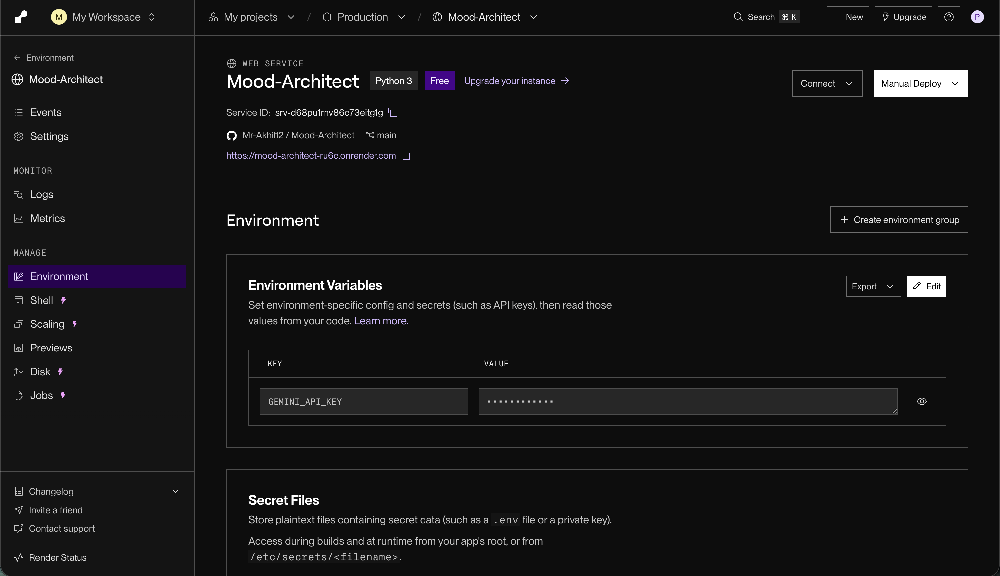

# Mood Architect - Project Submission

## 📋 Submission Checklist

### ✅ Public GitHub Repository
**Repository URL:** [https://github.com/Mr-Akhil12/Mood-Architect](https://github.com/Mr-Akhil12/Mood-Architect)

### ✅ Live Application
**Frontend URL:** [https://mood-architect-v1.vercel.app/](https://mood-architect-v1.vercel.app/)

### ✅ Backend API
**Backend URL:** [https://mood-architect-ru6c.onrender.com](https://mood-architect-ru6c.onrender.com)

### ✅ Environment Variable Configuration Screenshots

#### Vercel Environment Variables (Frontend)

*Shows `VITE_API_URL` configured to point to the Render backend endpoint*

#### Render Environment Variables (Backend)

*Shows `GEMINI_API_KEY` configured securely (value blurred for security)*

---

## 🚀 Future Improvements

Given more time, the following enhancements would significantly improve the application:

- **Rate Limiting & Quota Management**
  - Implement user-based rate limiting to prevent API abuse
  - Add Redis-based caching for frequently requested affirmations
  - Monitor and manage Gemini API quota more effectively

- **User Authentication & History**
  - Add authentication system (Auth0 or Firebase)
  - Store affirmation history in PostgreSQL database
  - Enable users to track emotional trends over time with data visualizations

- **Enhanced Animations & Interactions**
  - Implement GSAP-based page transitions
  - Add micro-interactions for button clicks and form submissions
  - Create more sophisticated loading states with skeleton screens

- **Multi-language Support**
  - Integrate i18n (vue-i18n) for internationalization
  - Support affirmations in multiple languages (Spanish, French, Japanese, etc.)
  - Detect user's browser language for automatic locale selection

- **Comprehensive Testing Suite**
  - Unit tests: Pytest for FastAPI backend, Vitest for Vue frontend
  - Integration tests for API endpoints
  - E2E tests using Playwright for critical user flows
  - Continuous Integration setup with GitHub Actions

---

**Built by Akhil Pillay**  
**Submission Date:** February 15, 2026
